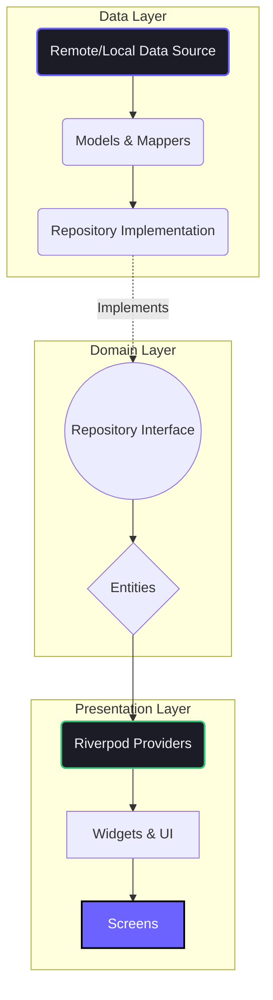

<div align="center">
  
  
  <p align="center">
    A scalable, modular, and production-ready Flutter boilerplate built on Feature-First Clean Architecture.
  </p>

  <div>
    
    
    
  </div>
</div>

---

## 🚀 Overview

The Antigravity Boilerplate minimizes initial project setup friction. It enforces strict separation of concerns, guarantees predictability across the codebase, and hooks out-of-the-box into Firebase for rapid backend deployment.

**Key Highlights:**
- **Riverpod** for declarative state management.
- **GoRouter** for scalable, declarative routing.
- **Firebase integration** mapped specifically to free-tier capacities.
- **Global Theme Engine** pre-configured for seamless Dark/Light setups.
- **120 lines-per-file constraint** baked into the project DNA to force component extraction.

---

## 🏗️ Architecture

We strictly follow **Feature-First Clean Architecture**. Every feature lives in isolation, minimizing cross-feature dependencies and avoiding "spaghetti" code.



### Folder Structure
> Self-contained modules per feature. Shared utilities exist strictly in `/core` or `/shared`.

```text
lib/
├── core/             # App-wide constants, formatting, validators
├── features/         # Feature-specific isolation
│   └── auth/         # Example: Authentication feature
│       ├── data/     # Repository impl, models, Firebase calls
│       ├── domain/   # Repository interfaces
│       └── presentation/ # UI and Riverpod providers
├── routing/          # GoRouter definitions & Navigation guards
├── services/         # Shared raw SDK logic (e.g. Firebase wrappers)
├── shared/           # Globally reused UI components & Models
└── theme/            # Design tokens, Typography, Animations
```

---

## ⚙️ Setup & Installation

### Prerequisites
- Flutter SDK (latest stable)
- Firebase CLI (`firebase-tools`)
- FlutterFire CLI

### 1. Clone & Install
```bash
git clone https://github.com/Konete326/flutter_Boiler_plate
cd flutter_Boiler_plate
flutter pub get
```

### 2. Environment Variables
Secure keys must never be committed. We use `flutter_dotenv`.
```bash
cp .env.example .env
```
*(Populate `.env` with your active keys).*

### 3. Firebase Connectivity
Configure Firebase securely out of the box:
1. Create a project at [Firebase Console](https://console.firebase.google.com).
2. Enable **Authentication** (Google Sign-In), **Realtime Database**, and **Storage**.
3. Apply security rules strictly from `docs/FIREBASE_RULES.md`.
4. Run:
```bash
flutterfire configure
```

### 4. Run
```bash
flutter run
```

---

## 🔒 Security Principles
- **No Test Mode in Prod**: Realtime database and Storage rules use default global *deny*. Explicitly grant endpoint access.
- **Env Separation**: Zero hard-coded logic parameters or API keys.

---

## 📫 Maintainer & Contact

Developed and maintained by **Muhammad Sameer**.

- **Email**: [sameerdevexpert@gmail.com](mailto:sameerdevexpert@gmail.com)
- **LinkedIn**: [Sameer Akram](https://www.linkedin.com/in/sameer-akram-52662a28a/)
- **GitHub**: [@Konete326](https://github.com/Konete326)

*Have questions about architectural patterns or need a custom feature module built? Connect with me via LinkedIn or shoot me an email.*
